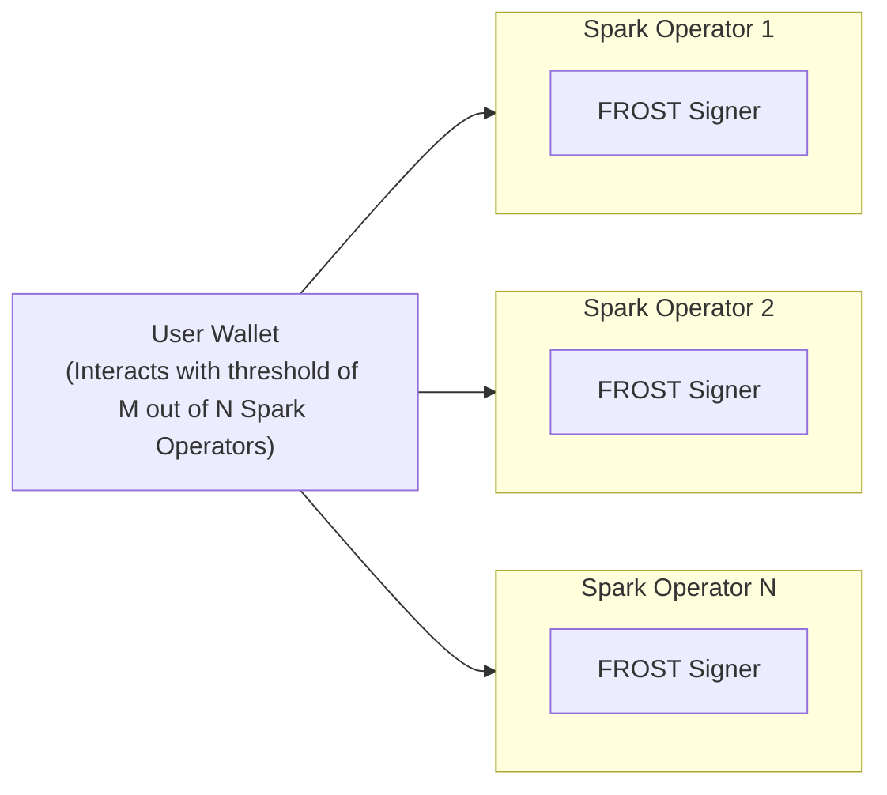

# Spark

Spark is a Bitcoin layer 2 scaling solution that enables secure and fast transactions through a novel shared signature scheme that powers off-chain transfers of native BTC and other assets.

## Architecture Overview

### Core Components

Spark consists of several key components that work together to power transactions:

1. **Spark Operator (SO)** - The primary service responsible for:

   - Managing state and the transaction tree
   - Coordinating distributed key generation
   - Processing deposits, transfers, and withdrawals
   - Managing key tweaks and key deletion
   - Providing a gRPC API for clients

2. **FROST Signer** - A Rust-based service implementing our custom Spark-FROST threshold signatures:

   - Provides distributed key generation capabilities
   - Handles cryptographic operations for multi-party signatures
   - Enables secure transaction signing without any party having the full key

3. **User Wallet** - Client-side implementation for end users:

   - Manages user key material
   - Initiates transactions
   - Communicates with the Spark Operator via gRPC

4. **LRC20 Token Support** - Extended functionality for token operations:
   - Token creation, minting, and management
   - Token transfer operations
   - Tree-based representation of token ownership

### System Architecture

The system follows a distributed architecture where users interact with multiple Spark operators that collectively form a Spark entity:



In this architecture:

1. **Multiple Spark Operators** form a distributed network. Each operator runs:

   - An SO instance that processes transactions and edits state
   - A FROST Signer that handles its portion of the threshold signing process
   - A PostgreSQL instance that holds the state

2. **User Wallets** interact with a threshold of these operators (M out of N) to:

   - Initiate and process transactions
   - Ensure security through threshold cryptography

3. All operations ultimately yield a signed Bitcoin transaction which can be used to unilaterally exit.

### Key Features

- **MPC**: Uses FROST (Flexible Round-Optimized Schnorr Threshold) signatures for secure, distributed signing
- **Tree-Based Transaction Structure**: Efficient and parallel representation of transaction history and ownership
- **Token Support**: Extended functionality to support token issuance and transfers via LRC20

## Getting Started

### Prerequisites

Before setting up the Spark development environment, ensure you have the following installed:

- **Go** (1.18+)
- **Rust** (with Cargo)
- **PostgreSQL**
- **Bitcoin Core** (with ZMQ support)
- **tmux** (for running the development environment)
- **Protocol Buffers**

#### Core Dependencies

```bash
# Install Go dependencies
go install google.golang.org/protobuf/cmd/protoc-gen-go@latest
go install google.golang.org/grpc/cmd/protoc-gen-go-grpc@latest
go install github.com/envoyproxy/protoc-gen-validate@latest

# Install system dependencies (MacOS)
brew install tmux protobuf zeromq bitcoin postgresql golangci-lint sqlx-cli cargo
```

#### PostgreSQL Setup

Ensure PostgreSQL is running and properly configured:

```bash
# Create a role for your user
psql -U postgres -c "CREATE ROLE $USER WITH LOGIN SUPERUSER;"

# Find your PostgreSQL data directory
psql -U postgres -c "SHOW data_directory;"

# Configure PostgreSQL to accept TCP/IP connections by editing postgresql.conf and pg_hba.conf
# Sample configuration available in the Development Environment section below
```

### Setup and Build

1. **Clone the repository**:

   ```bash
   git clone -b cleaning https://github.com/lightsparkdev/spark.git
   cd spark
   ```

2. **Run the entire stack** (Spark Operator, Bitcoin node, FROST signer, LRC20 node):
   ```bash
   ./run-everything.sh
   ```

### Running Tests

#### Unit Tests

```bash
# In the spark directory
go test $(go list ./... | grep -v -E "so/grpc_test|so/tree")
```

#### End-to-End Tests

After starting the stack with `run-everything.sh`:

```bash
# In the spark directory
go test ./so/grpc_test/...
```

## Development Environment

### Database Migrations

We use Atlas to manage database migrations:

```bash
# After making schema changes, run:
make ent

# Generate a new migration
createdb operator_temp
atlas migrate diff <diff_name> \
--dir "file://so/ent/migrate/migrations" \
--to "ent://so/ent/schema" \
--dev-url "postgresql://127.0.0.1:5432/operator_temp?sslmode=disable&search_path=public"
dropdb operator_temp

# Apply migrations manually (if needed)
atlas migrate apply --dir "file://so/ent/migrate/migrations" --url "postgresql://127.0.0.1:5432/operator_0?sslmode=disable"
```

For existing databases, you may need the `--baseline` flag:

```bash
atlas migrate apply --dir "file://so/ent/migrate/migrations" --url "postgresql://127.0.0.1:5432/operator_0?sslmode=disable" --baseline 20250228224813
```

### PostgreSQL Configuration

Sample `postgresql.conf` settings:

```
hba_file = './pg_hba.conf'
ident_file = './pg_ident.conf'
listen_addresses = '*'
log_destination = 'stderr'
log_line_prefix = '[%p] '
port = 5432
```

Sample `pg_hba.conf` settings:

```
#type  database  user  address       method
local   all       all                trust
host    all       all   127.0.0.1/32 trust
host    all       all   ::1/128      trust
```

### IDE Configuration

For VS Code, add this to your settings if you encounter issues with `.udl` files:

```json
"files.associations": {
    "spark_frost.udl": "plaintext"
}
```

### Linting

```bash
# Run the linter
golangci-lint run
```

## Troubleshooting

1. **Logs**: Spark operator and signer logs are located in `_data/run_X/logs/`

2. **tmux Sessions**: Use the following to connect to the tmux session:

   ```bash
   # Connect to the operator session
   tmux attach -t operator

   # Alternative for iTerm2 users
   tmux -CC attach -t operator
   ```

3. **First Run**: The first time you run `run-everything.sh`, it may take a while and might need to be run multiple times to properly initialize all components.

4. **Bitcoin regtest**: If you need to interact with the Bitcoin regtest node:
   ```bash
   bitcoin-cli -conf=/path/to/spark/bitcoin_regtest.conf getblockchaininfo
   ```

## Documentation

For more detailed information about specific components:

- See [/spark/README.md](/spark/README.md) for details on the core implementation
- See [/signer/README.md](/signer/README.md) for documentation on the FROST signer
- See [/spark/so/README.md](/spark/so/README.md) for details on the Spark Operator
